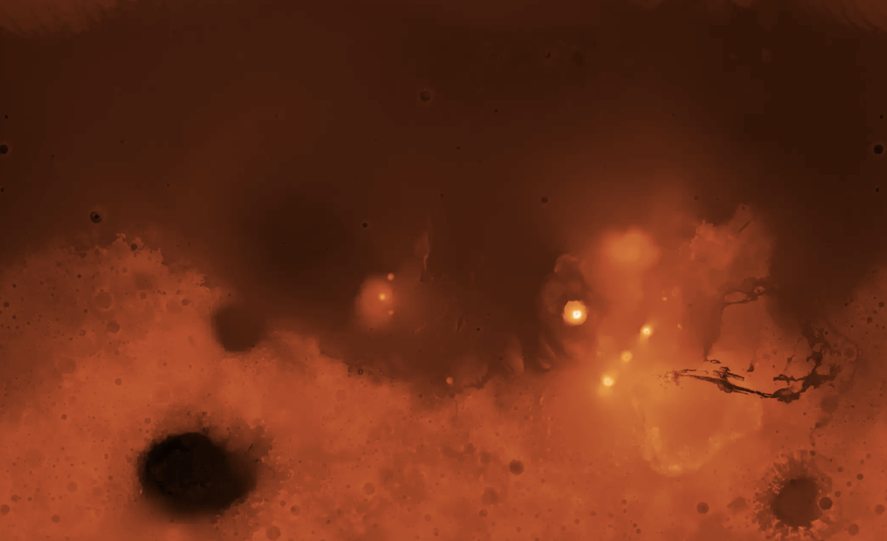

# Map of Mars

This is interactive map of Mars: https://anvaka.github.io/mars/

[](https://anvaka.github.io/mars/)

# Details

The map was made from a [publicly available digital elevation model](https://astrogeology.usgs.gov/search/map/Mars/Topography/HRSC_MOLA_Blend/Mars_HRSC_MOLA_BlendDEM_Global_200mp_v2). 
Maximum resolution of the model is 200 meters per pixel.

I converted the model into 8 bit, and uploaded it into MapBox studio. The uncorrected labels come from the 
[Gazetteer of Planetary Nomenclature](https://planetarynames.wr.usgs.gov/Page/MARS/target).

To add colors to the map, I had to patch [mapbox-gl-js](https://github.com/anvaka/mapbox-gl-js/tree/color-ramp)
library. The patch is not supposed to be "production" quality, but might serve as an inspiration for a [long time
feature request](https://github.com/mapbox/mapbox-gl-js/issues/3889) solution on main mapbox-gl repository.

# Patronage

If you like this work please consider sponsoring the project:

* [Via PayPal](http://paypal.me/anvakos/4)
* [Via GitHub Sponsors](https://github.com/sponsors/anvaka)

Your support will be used to pay for MapBox hosting services and further development of this project ❤️.

# Local development

```
npm install
npm start
```

Note: You'd have to use your own MapBox token in order to build the project. Simply create a file in `src/token.js`
with the following content:

``` js
export const MAPBOX_TOKEN = '... your mapbox token ...';
```

# License

The source code is licensed under MIT license.